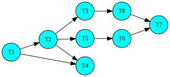

# Process Lineage - see the dependency graph using NetworkX

Every complex data processing environment consists of hundreds of data pipelines. Each of these pipelines is called a workflow. A workflow may have several steps to move data around. Every unit of work within a workflow is referred as task. These tasks have dependency among them. Tasks within a workflow along-with their dependencies can be viewed as a directed acyclic graph (DAG).

Here is  DAG drawn using [DOT language](https://www.graphviz.org/doc/info/lang.html)

### References

* [DOT language](https://www.graphviz.org/doc/info/lang.html)
* [Drawing graphs with dots](https://www.graphviz.org/pdf/dotguide.pdf)

## Authors

* **Abhijit Bhattacharya** 
