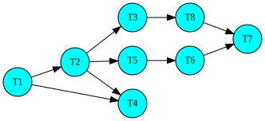
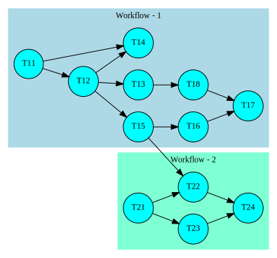

# Process Lineage - see the dependency graph using NetworkX

Every complex data processing environment consists of hundreds of data pipelines. Each of these pipelines is called a workflow. A workflow may have several steps to move data around. Every unit of work within a workflow is referred as task. These tasks have dependency among them. Tasks within a workflow along-with their dependencies can be viewed as a directed acyclic graph (DAG).

Following is a task dependency graph of a workflow  DAG drawn using [DOT language](https://www.graphviz.org/doc/info/lang.html)

Workflows have dependency across them. Specifically a task in a workflow can depend on a predecessor task in the same workflow or on a task in different workflow. Next diagram shows such a scenario. Here also the diagram is generated using DOT language and using clustering of nodes to contrast one workflow from another.

# Problem statement

Most of the industry grade orchestration tool like [Airflow](https://airflow.apache.org/) or [Azkaban](https://azkaban.github.io/) provide polished UI to look at intra and inter-workflow dependency though dependency across multiple workflows may require multiple navigational actions (mouse clicks) and it becomes challenging to remember the starting context after navigating multiple levels.  

Each of the tasks in workflow has several attributes. For example - run time, start time etc. Attributes like run time can vary from one day to another as the volume of data processed can change from one day to another. To keep things simple, I will assume run time is not varying - let us assume that we are dealing with median value of the run time of each task if we have access to historical task & workflow run time data. 

So the new graph looks like the following. The numbers inside curly braces is the median elapsed time for the task.

Additional information for these two workflows are - T24 & T17 are two SLA bound steps. Let us assume that they provide key metric values to show the health of the business

Few questions that I would like to answer specially when I am on-call person

* List of all paths terminating at T17 or T24
* Among all paths found, can I identify the path with highest run time? This is the critical path. Any delay in critical path will impact final data availability.
* Assume there were two failures last night - one resulted in delay of T12 and the other one is delayed T23, which of these two failures can be attributed to SLA miss?
* Ability to answer what-if scenarios like - T11 usually gets started by 1:00 AM PST while T21 can only start by 3:00 AM PST. If today T11 can't start till 2:30 AM, will that result in SLA miss?

# Setup 

Each of the problem above requires graph traversal. Instead of reinventing the wheel, I will use one of Python's very well known package named `NetworkX` 

For visualizing the outcome of a graph operation, I will rely on DOT language. But instead of hand crafting DOT language script I will `pydot` to generate SVG documents which can be rendered in a browser.

Getting a large amount of real life data is useful. Most of task and workflow dependency data can be extracted from orchestration tools (e.g. Airflow or Azkaban) backend database. I will use Airflow's backend data, anonymize (task name, workflow name etc) and put them in a CSV file so that no business secret is exposed.

### References

* [DOT language](https://www.graphviz.org/doc/info/lang.html)
* [Drawing graphs with dots](https://www.graphviz.org/pdf/dotguide.pdf)
* [Pydot](https://pypi.org/project/pydot-ng/)

## Authors

* **Abhijit Bhattacharya** 
